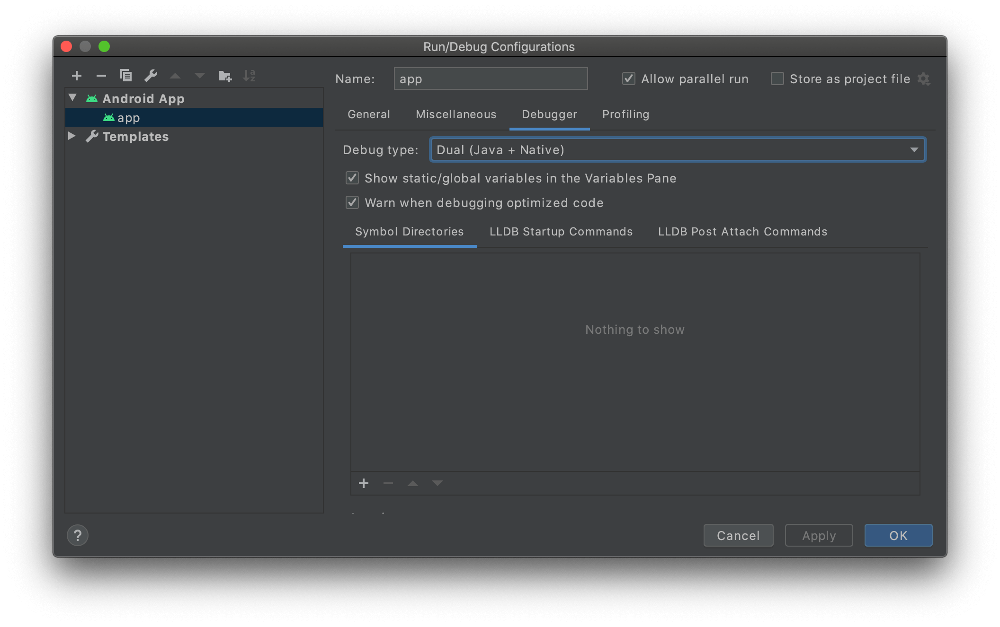
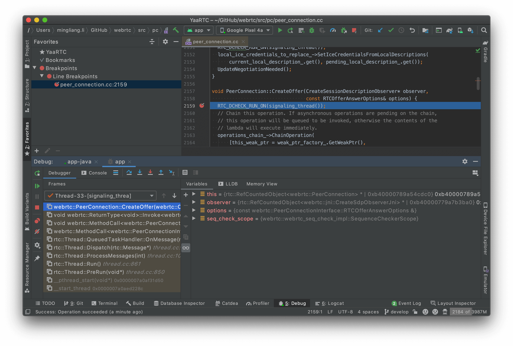

WebRTC 在 Android 上的断点调试还是比较麻烦的，目前中文互联网引用得比较多的这篇 [macOS 下单步调试 WebRTC Android & iOS](https://blog.piasy.com/2018/08/14/build-webrtc/index.html) 在笔者看来显得复杂了。笔者结合另一篇文章 [WebRTC Android 的调试](http://blog.pprtc.com/2020/10/14/WebRTC-Android-debug/) 给出一个简单有效的 Android 调试方法（原文略显晦涩）。

## 编译 Debug 包

打断点自然需要使用到包含调试信息的 .so 文件。首先要避免编译时这些信息被 strip 掉，因此需要修改 Android 平台的编译配置，文件路径参见代码标题：

```bash:title=./build/toolchain/android/BUILD.gn
...
template("android_clang_toolchain") {
  ...
  _prefix = rebase_path("$clang_base_path/bin", root_build_dir)
  cc = "$_prefix/clang"
  cxx = "$_prefix/clang++"
  ar = "$_prefix/llvm-ar"
  ld = cxx
  readelf = _tool_prefix + "readelf"
  nm = _tool_prefix + "nm"
  # 注释掉下面两行配置，即可实现 unstrip
  # strip = rebase_path("//buildtools/third_party/eu-strip/bin/eu-strip",
  #                     root_build_dir)
  # use_unstripped_as_runtime_outputs = android_unstripped_runtime_outputs
  ...
}
...
```

接着我们可以根据 [编译源码](https://webrtc.mthli.com/basic/webrtc-compilation/) 进行编译，不过我们需要添加一些 build_aar.py 的编译参数：

```bash
$ ./tools_webrtc/android/build_aar.py \
  --extra-gn-args "is_debug=true symbol_level=2 android_full_debug=true" \
  --arch arm64-v8a
```

这里我们只需要编译 arm64-v8a 架构的包用来做真机调试（编译全架构需要大约 60 分钟）。编译完成后记住将生成的 libwebrtc.aar 拷贝到本机（宿主机）上。

PS，unstrip 编译 armeabi-v7a 时会抛出 `ERROR Input to target not generated by a dependency.` ，考虑到这不是本文的重点，笔者认为没有必要专门花时间解决。不过如果有读者知道解决方案可以留言评论 🙏

## 准备 WebRTC 源码

有了包含调试信息的 .so 文件之后，我们还需要对应的源码。如果读者没有修改 WebRTC 源码的打算，则只需要在 macOS 上配置好 [depot_tools](https://commondatastorage.googleapis.com/chrome-infra-docs/flat/depot_tools/docs/html/depot_tools_tutorial.html#_setting_up) 然后直接 fetch 源码到本机并切换到对应分支就可以了。macOS 只是不能直接编译 WebRTC 而已，depot_tools 还是可以使用的。

如果你需要调试的是自己改动过的 WebRTC 代码，则需要把改动过的代码同步到本机。首先执行 `vagrant halt` 关闭虚拟机，然后在 Vagrantfile 中做如下配置，否则从虚拟机**批量**拷贝源码到本机的共享目录时会因为权限问题而失败：

```bash:title=Vagrantfile
Vagrant.configure("2") do |config|
  ...
  # 将 Vagrantfile 所在的目录挂载到虚拟机的 /vagrant 目录，
  # 且该目录的读写权限为 775，文件读写权限为 777
  config.vm.synced_folder ".", "/vagrant",
    mount_options: ["dmode=775,fmode=777"]
end
```

然后再执行 `vagrant up` 重启虚拟机，再执行 `vargant ssh` 登录虚拟机。此时再执行批量拷贝源码到本机就不会再遇到权限问题了。

PS，聪明的读者可能已经想到，如果从最开始 [编译源码](https://webrtc.mthli.com/basic/webrtc-compilation/) 时就直接把源码 fetch 到共享目录，本机和虚拟机不就可以共享同一份源码了嘛？笔者最初也是这样想的，可是在共享目录并不能编译成功。感兴趣的读者可以自己试一试，如果有解决方案可以留言评论 😄

## 断点调试配置

我们继续以 [mthli/YaaRTC](https://github.com/mthli/YaaRTC) 这个项目为例，首先将项目里的 libwebrtc.aar 替换为我们自己刚刚编译好的 libwebrtc.aar。接着需要在 `app/build.gradle` 中做如下配置：

```groovy:title=app/build.gradle
...
android {
  ...
  buildTypes {
    ...
    debug {
      ...
      debuggable true     // 必须设置为 true
      jniDebuggable true  // 必须设置为 true
      minifyEnabled false // 必须设置为 false
    }
  }

  ...
  packagingOptions {
    ...
    // 如果不设置 doNotStrip，编译出来的安装包还是会丢失调试信息；
    // 因为我们只编译了 arm64-v8a 架构的包，所以只需要配置这一行即可
    doNotStrip "*/arm64-v8a/*.so"
  }
}
...
```

然后将 Android Studio 的 Run ➔ Edit Configuration&#8230; 的 Debug type 设置为 `Dual (Java + Native)` ，否则你将无法调试到 Native 层面的代码：



现在让我们在 WebRTC Java 层打一个断点，比如 `PeerConnection.nativeCreateOffer()` 这个方法。显而易见，此时不论你怎么操作 Debugger，都不可能单步到 Native 层。不过这不重要，我们先启动 Debugger 并运行到断点处再说。

然后我们切换到 Debugger 的 LLDB 命令行，此时这个 Tab 是不能输入任何命令的。我们需要点击左边的（红色箭头所指的）暂停按钮，让其变为可输入命令的模式：


当 App 运行到断点处并自动暂停时，我们可以输入如下 LLDB 命令并得到输出：

```bash
# https://stackoverflow.com/a/53065726/4696820
# 查看 Native 层 webrtc::PeerConnection::RestartIce 这个方法的调试信息；
# 这里选用 RestartIce 而不是 CreateOffer 作为示例的原因是其输出单一，易于阅读
(lldb) image lookup -vrn webrtc::PeerConnection::RestartIce
```


看到 CompileUnit 这一行（红框部分），明确指出了 RestartIce 这个方法所处的源码路径。不过显然我们本机的 Android Studio 是无法索引到这个路径的，因为这是虚拟机里的路径。

如果读者只是需要使用 LLDB 命令行打断点的话，那么文章读到这里就可以结束了。但我们的目的肯定不是通过命令行打断点，而是希望使用 Android Studio 的图形界面直接打断点。因此需要将 CompileUnit 记录的虚拟机路径与我们本机的 WebRTC 源码关联起来。

假设本机的 WebRTC 源码所在路径为 `~/GitHub/webrtc/src` ，则我们需要将 CompileUnit 中的路径前缀 `./../../../home/vagrant/webrtc/src` 替换为这个路径。此时可以在 Android Studio Debugger 的 LLDB Startup Commands 中添加如下命令：

```bash
# NEW_PATH_PREFIX 务必为绝对路径，否则 LLDB 会替换失败（无法识别）
# settings set target.source-map OLD_PATH_PREFIX NEW_PATH_PREFIX
settings set target.source-map ./../../../home/vagrant/webrtc/src /Users/mingliang.li/GitHub/webrtc/src
```


然后你就可以随意在本机的 WebRTC 源码上打断点了。比如使用 Android Studio 打开本机的 `~/GitHub/webrtc/src/pc/peer_connection.cc` 并在 `PeerConnection::CreateOffer` 这个方法中随意打一个断点，然后以 Debug 模式编译并运行之：



可以看到，我们已经成功打上断点了。有了断点调试能力以后，我们便可以深入源码学习 WebRTC 了；本书后续亦将结合源码，解构 WebRTC 的内部流程 🍻

在实际的团队开发 WebRTC 的过程中，可能是由某一方同时维护和输出包含全部调试信息的 Debug 包，和去除所有调试信息的 Release 包。对于其他开发同学而言，即可使用上述 LLDB 路径替换的方式，将自己本机的 WebRTC 源码与 Debug 包关联起来，一劳永逸。
